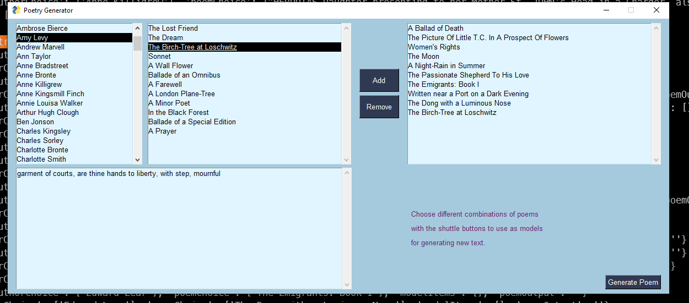

# Text Geneartion with Markov Chain Model

The program builds a Markov Chain Model with poems from a [PoetryDB](https://poetrydb.org/index.html) API and generates text by making a random walk along the graph.

Created with [PySimpleGUI](https://pysimplegui.readthedocs.io/en/latest/)

